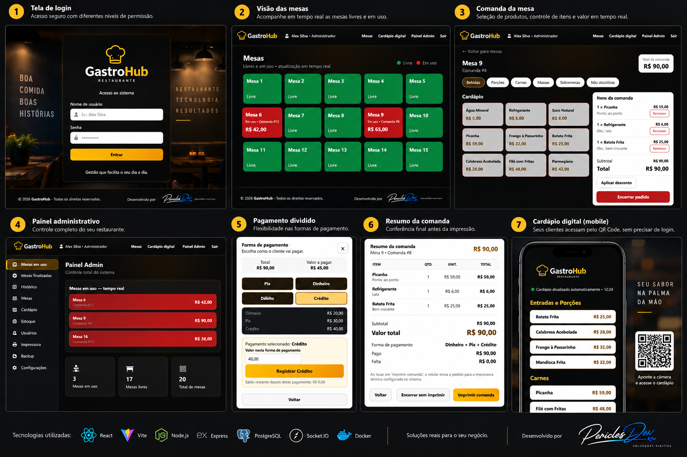

# PericlesDev Comanda

Sistema web de **comandas, mesas e atendimento para restaurantes**, projetado para operar em **rede local (LAN)**. Um notebook funciona como servidor do estabelecimento e celulares/tablets conectados à mesma rede acessam o sistema em tempo real.

## 🖥️ Demonstração



Interface demonstrativa com identidade e dados fictícios para apresentação do projeto.

> Projeto de portfólio / base demonstrativa. Não contém dados, identidade visual, usuários ou backups de clientes reais.

## Principais recursos

- Mesas e comandas compartilhadas em tempo real
- Perfis de **Administrador** e **Garçom**
- Lançamento de produtos, variantes, quantidades e observações
- Controle de estoque com atualização em tempo real
- Pagamento dividido entre Dinheiro, Pix, Crédito e Débito
- Encerramento, histórico e relatório diário
- Cardápio digital por QR Code na rede local
- Impressão térmica centralizada pelo notebook
- Reimpressão de comandas finalizadas e relatórios
- Backup manual e automático do PostgreSQL
- Interface responsiva para notebook, celular e tablet

## Stack

- **Frontend:** React 19, Vite, React Router
- **Backend:** Node.js, Express
- **Banco:** PostgreSQL 17
- **Tempo real:** Socket.IO
- **Infraestrutura:** Docker / Docker Compose
- **Impressão:** Web Bluetooth + agente central de impressão

## Arquitetura

```text
Celulares / Tablets
        │
        │ Wi-Fi / LAN
        ▼
Notebook do estabelecimento
  ├─ Node.js + Express :3000
  ├─ Socket.IO (realtime)
  ├─ Navegador / agente de impressão
  │       └─ Bluetooth → Impressora térmica
  └─ Docker
       └─ PostgreSQL 17 :5433 → :5432
```

O PostgreSQL é publicado apenas em `127.0.0.1`, portanto não fica diretamente exposto à rede local. Os clientes acessam somente o servidor HTTP do aplicativo.

## Executando localmente

### Requisitos

- Node.js LTS
- Docker Desktop + Docker Compose
- Windows 10/11 para os scripts `.bat` incluídos

### Instalação

Clone o repositório e entre na pasta:

```bash
git clone <URL-DO-SEU-REPOSITORIO>
cd periclesdev-comanda
```

Instale as dependências:

```bash
npm install
npm run build
```

No Windows, você também pode usar:

```text
scripts\INSTALAR_SISTEMA.bat
```

Para iniciar posteriormente:

```text
scripts\INICIAR_SISTEMA.bat
```

A aplicação fica disponível no notebook em:

```text
http://localhost:3000
```

Nos demais dispositivos da mesma rede, use o IPv4 do notebook:

```text
http://IP_DO_NOTEBOOK:3000
```

O script `scripts\VER_ENDERECO_IP.bat` ajuda a localizar o endereço IPv4.

## Acesso demonstrativo inicial

A base cria somente um administrador local de demonstração:

```text
Usuário: Administrador
Senha: 12345678
```

**Troque a senha antes de qualquer uso real.** Para uma implantação em produção, personalize também as credenciais locais do PostgreSQL.

## Personalização

A identidade visual genérica está em:

```text
src/assets/logo-cliente.svg
```

O cardápio, usuários e configurações podem ser cadastrados pela área administrativa. A estrutura inicial do banco está em `server/db/init.sql`.

## Segurança

- O repositório não deve conter `.env`, backups, bancos exportados ou credenciais reais.
- `.gitignore` bloqueia arquivos `.env`, `*.backup`, `node_modules`, `dist` e diretórios de backup.
- Senhas de usuários são armazenadas como hash no PostgreSQL.
- Sessões usam tokens aleatórios com expiração.
- Operações administrativas exigem perfil de administrador.
- O PostgreSQL do Docker é vinculado a `127.0.0.1`.

Para um repositório público, também é recomendado habilitar no GitHub **Dependabot**, **secret scanning**, **push protection** e **code scanning**.

## Estrutura resumida

```text
src/                 interface React
server/              API Node.js / Express
server/db/init.sql   schema e dados demonstrativos
scripts/             instalação, inicialização, backup e IP
docker-compose.yml   PostgreSQL local
```

## Observação sobre impressão

A impressão direta usa Web Bluetooth e depende do navegador/dispositivo. O projeto também inclui um agente central: o navegador do notebook mantém a conexão com a impressora e recebe trabalhos enviados pelos administradores na rede local.

## Autor

**PericlesDev** — desenvolvimento de sistemas web e soluções locais para negócios.

## Licença

Código disponibilizado para demonstração de portfólio. Consulte o arquivo `LICENSE` antes de reutilizar, redistribuir ou utilizar comercialmente.
